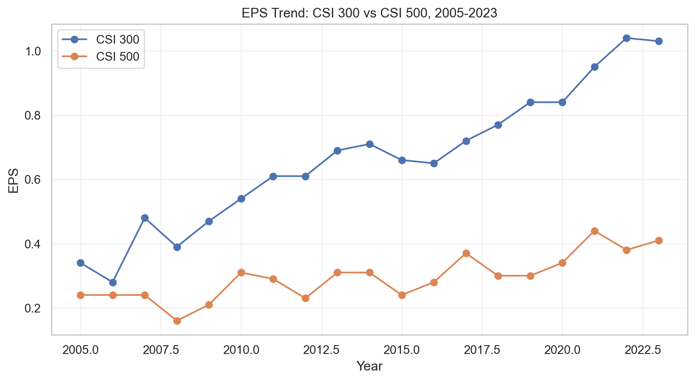
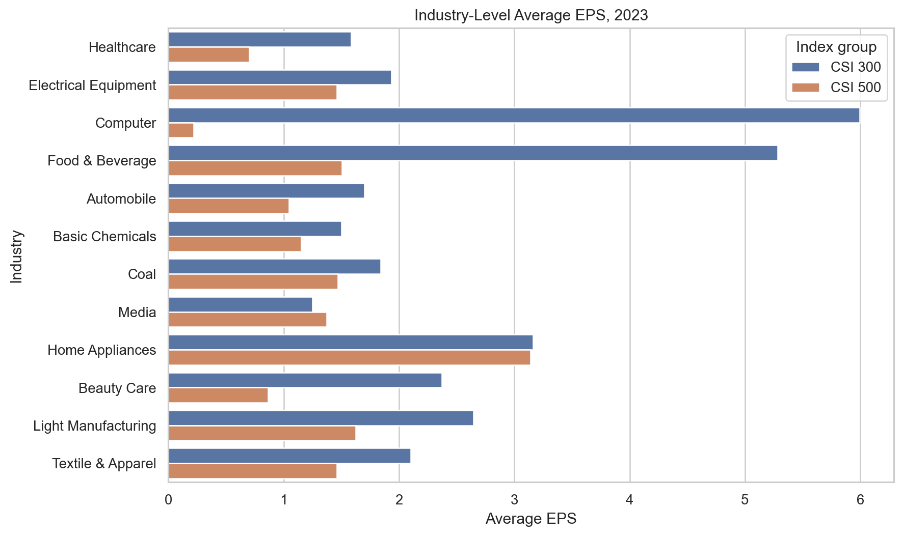

# Firm Size and Profitability in China's A-Share Market

This project studies whether larger listed firms in China's A-share market are more profitable than mid-sized firms. It uses CSI 300 constituents as a proxy for large firms and CSI 500 constituents as a proxy for mid-sized firms.

The project started as a course report and has been upgraded into a reproducible empirical finance and data-product repository with data cleaning scripts, chart generation, panel-style regression models, robustness checks, and an interactive Streamlit dashboard suitable for GitHub and graduate school applications.

## Research Question

Do larger firms show stronger and more stable profitability than smaller firms in China's A-share market?

## Data

The source data comes from the original course project files exported from Wind and iFinD/Tonghuashun. The local source files include:

- Annual CSI 300 and CSI 500 EPS data, 2005-2023
- Firm-level EPS, total assets, market capitalization, and industry data for selected years
- Industry-level EPS comparison tables
- EPS-to-asset comparison tables

Because the original Wind/iFinD exports may be subject to database licensing restrictions, this repository is structured so that raw files can be kept locally in `data/raw/` or read from the original course folder.

## Methodology

The analysis currently includes:

- EPS trend comparison between CSI 300 and CSI 500
- Annual EPS growth rate comparison
- Compound annual growth rate comparison
- EPS growth volatility comparison
- EPS-to-asset efficiency comparison
- Industry-level EPS comparison
- Panel-style firm-level regression using available company-year observations
- Year and industry fixed effects
- Robustness checks using non-financial firms, winsorized EPS, alternative efficiency outcomes, and firm fixed effects
- Interactive dashboard for filtering by year, industry, index group, and market capitalization

The main fixed-effects specification is:

```text
EPS_it = alpha + beta1 log(MarketCap_it) + beta2 log(Assets_it)
         + beta3 CSI500_it + Industry FE + Year FE + error_it
```

The firm-level dataset is an unbalanced selected-year panel rather than a complete annual panel. The current company-level years are based on the available original exports and are used for empirical extension and robustness testing.

## Empirical Models

The Level 2 version estimates six model variants:

- `M1_pooled_ols`: pooled benchmark regression.
- `M2_year_industry_fe`: year and industry fixed effects.
- `M3_non_financial_fe`: excludes banks and non-bank financial firms.
- `M4_winsorized_eps_fe`: winsorizes EPS at the 1st and 99th percentiles.
- `M5_efficiency_fe`: uses winsorized EPS/assets as an alternative outcome.
- `M6_firm_year_fe`: uses repeat-firm observations with firm and year fixed effects.

Regression outputs are saved in:

- `output/tables/panel_regression_summary.csv`
- `output/tables/panel_regression_coefficients.csv`
- `output/tables/panel_regression_summary.md`

## Interactive Dashboards

The Level 3 version adds two dashboard options:

- `app.py`: Streamlit app for local use or Streamlit Community Cloud.
- `docs/index.html`: static HTML dashboard for GitHub Pages preview.

Run the Streamlit app:

```bash
streamlit run app.py
```

Build the static HTML dashboard:

```bash
python src/build_static_dashboard.py
```

Then publish it with GitHub Pages:

1. Push this repository to GitHub.
2. Go to repository `Settings` -> `Pages`.
3. Set `Source` to `Deploy from a branch`.
4. Select the `main` branch and the `/docs` folder.
5. The dashboard will be available at the GitHub Pages URL shown by GitHub.

Dashboard features:

- Filter observations by year, industry, index group, and market capitalization range.
- Compare CSI 300 and CSI 500 EPS trends.
- Explore firm-level size-profitability scatter plots.
- Compare industry-level average EPS and market capitalization.
- Review fixed-effects regression results interactively.

ROA is not calculated yet because the current raw exports do not include net income. The dashboard therefore reports EPS, market capitalization, total assets, and `EPS/assets` as an asset-efficiency proxy. A future version can add ROA once net income is included.

## Key Preliminary Findings

- CSI 300 firms generally have higher EPS than CSI 500 firms.
- CSI 300 EPS growth is more stable over time.
- CSI 500 firms had much higher EPS-to-asset ratios in earlier years, but this efficiency gap narrowed substantially by 2023.
- Industry composition matters: profitability differences are not explained by firm size alone.
- Asset expansion appears to have outpaced EPS growth across both large and mid-sized firms.
- In firm-level regressions, market capitalization is positively associated with EPS across the main fixed-effects and robustness specifications.
- The CSI 500 group indicator is less stable once year and industry fixed effects are included, suggesting that index-level differences partly reflect firm size, industry mix, and time effects rather than index membership alone.

## Selected Outputs





## Repository Structure

```text
.
├── README.md
├── app.py
├── docs
│   └── index.html
├── requirements.txt
├── data
│   ├── raw
│   │   └── README.md
│   └── processed
├── output
│   ├── figures
│   └── tables
├── report
│   ├── README.md
│   ├── dashboard_design.md
│   └── research_design.md
├── notebooks
│   └── README.md
└── src
    ├── clean_data.py
    ├── build_static_dashboard.py
    ├── visualize.py
    ├── run_pipeline.py
    └── regression.py
```

## How to Reproduce

Install dependencies:

```bash
pip install -r requirements.txt
```

Run the full pipeline:

```bash
python src/run_pipeline.py
```

Or run each step separately:

```bash
python src/clean_data.py
python src/visualize.py
python src/regression.py
```

Generated outputs will be saved to:

- `data/processed/`
- `output/figures/`
- `output/tables/`

## Application Positioning

This project demonstrates:

- Empirical finance research design
- Financial data cleaning from Excel exports
- Time-series and cross-sectional comparison
- Industry-level decomposition
- Panel-style regression modeling with fixed effects
- Robustness testing and transparent limitations
- Interactive data-product design with Streamlit
- Reproducible research workflow in Python

Suggested resume description:

> Conducted an empirical study on the relationship between firm size and profitability in China's A-share market using CSI 300 and CSI 500 constituent data from 2005 to 2023. Built reproducible Python data pipelines, calculated profitability and efficiency metrics, generated publication-ready visualizations, estimated panel-style regressions with year, industry, and firm fixed effects, and developed a Streamlit dashboard for interactive exploration.

## Next Improvements

- Expand company-level data into a full annual firm-year panel.
- Add net income and book equity to support ROA and ROE in the dashboard.
- Add clustered or two-way clustered standard errors with a dedicated panel regression package.
- Test robustness using alternative size definitions such as revenue, employees, and book assets.
- Convert the final report into a polished English research paper.
